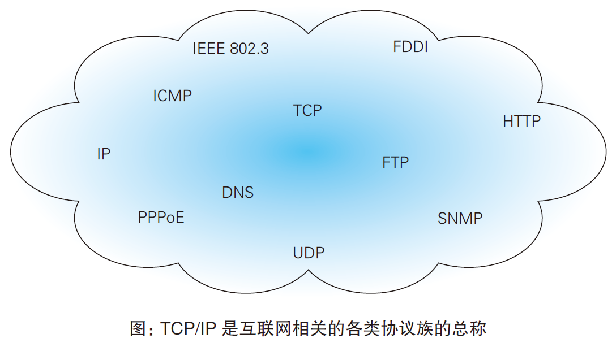

# 了解Web 及网络基础
## 1.1　使用HTTP 协议访问Web
Web 浏览器从 Web 服务器端获取文件资源（resource）等信息，从而显示出Web 页面。

客户端：像这种通过发送请求获取服务器资源的 Web 浏览器等

Web 是建立在 HTTP 协议上通信的。

## 1.2　HTTP 的诞生
HTTP/1.1 是目前主流的HTTP 协议版本。

## 1.3　网络基础TCP/IP
通常使用的网络（包括互联网）是在 TCP/IP 协议族的基础上运作的。
- HTTP 属于它内部的一个子集

### 1.3.1　TCP/IP 协议族
协议：不同的硬件、操作系统之间的通信，所有的这一切都需要一种规则。我们就把这种规则称为协议。

协议中存在各式各样的内容
- 电缆的规格
- IP 地址的选定方法
- 寻找异地用户的方法
- 双方建立通信的顺序
- Web 页面显示需要处理的步骤

把与互联网相关联的协议集合起来总称为 TCP/IP。

### 1.3.2　TCP/IP 的分层管理

TCP/IP 协议族按层次分为应用层、传输层、网络层和数据链路层

优点：
- 每个层次内部设计能够自由改动
- 每个层次只考虑分派给自己的任务

#### 应用层
向用户提供应用服务时通信的活动
- FTP（FileTransfer Protocol，文件传输协议）
- DNS（Domain Name System，域名系统）
- HTTP （hypertext transport protocol超文本传送协议）

#### 传输层
为应用层提供数据传输，传输的对象是处于网络连接中的两台计算机
- TCP（Transmission ControlProtocol，传输控制协议）
- UDP（User Data Protocol，用户数据报协议）

#### 网络层（又名网络互连层）
处理在网络上的数据包（网络传输的最小数据单位）。
该层规定了通过怎样的路径（传输路线）到达对方计算机。网络层在众多的传输路线中选择一条传输路线。

#### 链路层（又名数据链路层，网络接口层）
处理连接网络的硬件部分。
- 控制操作系统
- 硬件的设备驱动
- NIC（Network Interface Card，网络适配器，即网卡）
- 光纤

### 1.3.3　TCP/IP 通信传输流

HTTP 举例：

发送方：
- 应用层（HTTP 协议）：发送端的客户端发出一个想看某个 Web 页面的 HTTP 请求
- 传输层（TCP 协议）：为传输方便，把从应用层处收到的数据（HTTP 请求报文）进行分割，并在各个报文上打上标记序号及端口号后转发给网络层
- 网络层（IP 协议）：增加作为通信目的地的 MAC 地址后转发给链路层

封装（encapsulate）：
- 发送端每经过一层时必定会被打上一个该层所属的首部信息。  
- 接收端每经过一层时会把对应的首部消去。  

这种把数据信息包装起来的做法称为封装（encapsulate）。

## 1.4　 与HTTP 关系密切的协议：IP、TCP 和 DNS

### 1.4.1　负责传输的IP（Internet Protocol） 协议
网络层。作用：把各种数据包传送给对方。

保证数据传送到对方的两个重要的条件是 IP 地址和 MAC 地址（Media Access Control Address）。
- IP 地址指明了节点被分配到的地址，可变换。
- MAC 地址是网卡所属的固定地址，不会更改。

#### 使用 ARP 协议凭借 MAC 地址进行通信
ARP（Address Resolution Protocol）是根据 IP 解析 MAC 的协议。

作用：网络通信的双方通常要经过多次中转才能连接到对方。利用下一站中转设备的 MAC 地址来搜索下一个中转目标

#### 没有人能够全面掌握互联网中的传输状况
只能获悉很粗略的传输路线，无法全面掌握互联网中的细节。
选择传输路线的机制称为路由选择（routing）。

### 1.4.2　确保可靠性的TCP 协议
TCP 位于传输层，提供可靠的字节流服务。
- 字节流服务（Byte Stream Service）指将大块数据分割成以报文段（segment）为单位的数据包
- 可靠的传输服务指把数据准确可靠地传给对方

#### 确保数据能到达目标
三次握手（three-way handshaking）策略。
握手过程中使用了TCP 的标志（flag）、SYN（synchronize）和ACK（acknowledgement）。

 

