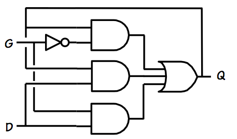
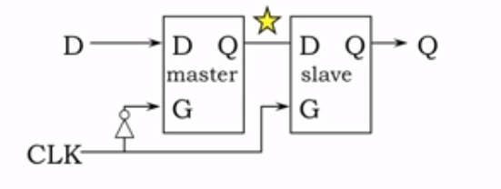
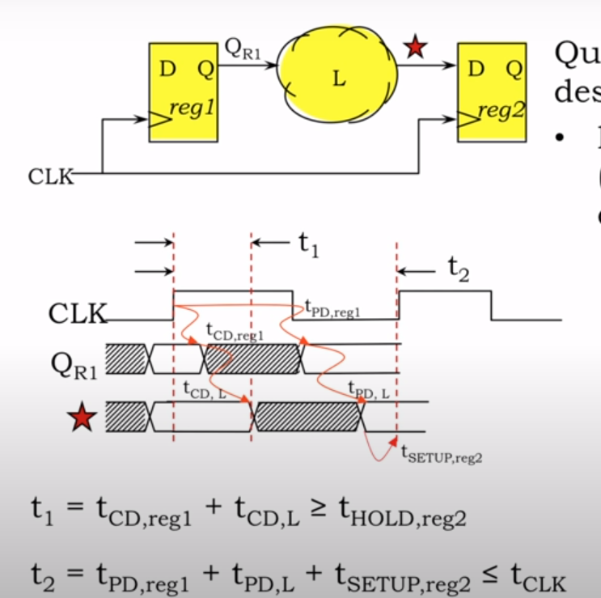

# Sequential Logic（顺序逻辑）

假设现在提出了一种新的需求：  
需要开关灯泡，灯开则关闭,灯关则打开。  
这种情况则无法使用 combination logic 去解决，因为  
1. 灯的开关状态不取决于输入值，而取决于之前的状态。
2. 我们现在面对的需求是『单击按钮』，而不是『按紧按钮』或者『松开按钮』。input 是一种 event，而不是一种 level。

因此我们需要引入『顺序逻辑』来解决这个问题。

## 顺序逻辑的定义

1. 顺序逻辑有两个输入，产生两组输出
   - 当前的**状态**和**输入值**一起作为顺序逻辑的输入
   - 产生出两个输出： **下一个状态** （与当前状态位数相同），**输出值**
2. 『Memory Device』 有两个输入，一个输出
3. 『LOAD 控制信号』解决**什么时候、用什么**使下一个状态代替当前状态
   - 由 **下一个状态和 『LOAD 控制信号』的输入值**产生当前状态
4. Memory Device 有以 bits 为单位的储存空间。如果能储存 K 位，Memory Device 最多有 2^K 个状态
 
## 如何设计出能储存状态的 Memory Device

### 方案1. 使用电容器
bits 是用电压表示的 (0V 表示 0，3V 表示 1)，因此考虑用电容来储存特定电压

电容器一端连接某个稳定的参考电压 Vref，电容器的另一端连接 NFET，NFET 的 Gate 连接 word line

要将一些信息写入设备：
- bit line 连接预定的电压 (digit 0 or digit 1)
- 把 word line 调高使得 NFET 打开
- 电容器充电或放电，总之达到了与 bit line 相同的电压
- 达到以后， word line 调低以关闭 NFET，理想情况下电荷会无期限停留在电容上

要访问储存的信息：
- bit line 达到某个中间电压
- 把 word line 调高使得 NFET 打开
- bit line 变高 -> 电容器储存的是 1
- bit line 变低 -> 电容器储存的是 0
- 但这种变化是很小的，要用到一种非常灵敏的放大器（感应放大器），

优点：
- 电容器价格便宜
缺点
- 交互复杂，access 时间长
- 外部电气噪音会导致电容器的电荷变化
- NFET 有漏电流，即使正式关上也没有关紧，需要反复读取和重写储存值以定期刷新内存

### 改进方案2. bi-stable storage
使用 positive feedback 来永久维护 storage

这是『双稳态存储元件』 (bi-stable storage)，这个逻辑门是为了恢复边缘信号电平而建立的，所以噪声不是问题

- 两端是稳定的，因此不会被噪音影响
- 中间是介稳态，总会滑向两端中的任意一端

## settable storage element (可配置存储元件)
可配置存储元件称为 latch。

### 使用 MUX 构建可配置存储元件

D latch 的特性：D 接数据输入，G 接 load 信号
- G 为 1，MUX 的输出与 Q' 无关，只与 D 有关
- G 为 0，MUX 的输出与 D 无关，只与 Q' 有关  （储存模式）

### 避免 G 的变化不会影响 Q 的输出
使用宽松的 MUX。

  
（每个阶段都有两个信号是稳定的）

在以下情况下输出值是有效值（D：数据输入，G：load 信号，Q：输出值，Q'：前一个 Q）：
1. G=1，D 在 TPD 的时间内稳定后，则保证 Q 的值与 Q' 无关（load信号是1，则输出与上一个输出无关，只与数据输入有关，这是非存储模式）
2. G=0，D 在 TPD 的时间内稳定后，则保证 Q 的值与 D 无关 （load信号是0，则输出与数据输入无关，只与上一个输出有关，这是存储模式）
3. Q=D 在 TPD 的时间内稳定后，则保证 Q 的值与 G 无关 （我们要确保 G 在变化时不会影响 Q 的输出）

### 可靠的 D latch 设计
D-latch 由宽松 MUX 组成  
load 信号变化时，输出变化的情况

- D-latch 的『设置时间』（G 变化前需要的时间）是 MUX 的传播延迟的两倍
  - 第一个 tPD,对应 G=1 的情况，此时刚好生成平稳的 Q
  - 第二个 tPD,对应 Q=D 的情况，此时 Q 的值与 G 无关，则表示已经平稳
- D-latch 的『保持时间』（G 变化后需要的时间）是 MUX 的传播延迟的一倍
  - 一个 tPD 内，G=0 的情况稳定， Q 的值与 D 无关，则表示已经平稳
需含有最少 D stable 的时间：  
G 改变前需要 2 个 TPD 的时间来达到稳定，G 改变后需要 1 个 TPD 的时间

### Latch Implementation
使用与非门设计一个 latch, latch 满足：  
Q = (NOT(G) AND Q) OR (G AND D)

这里面会有 glitch, 因此需要变成：  
 Q = (NOT(G) AND Q) OR (G AND D) OR (Q AND D)  
对应的图像为：  

## D Register
直接使用 D latch,如果闸门保持 high 太久，我们就在系统中形成了一个循环，新状态值会在循环中变化  
因此，我们需要小心翼翼地确定 Gate 为 HIGH 时的时间间隔。它必须足够长，以满足动态纪律的约束。但它必须足够短，使 D latch 在新的状态信息有机会传播到整个循环之前再次关闭。  
这种棘手的系统时序很可能是容易出错的，因为信号的准确时序几乎不可能保证。  
为了使这一工作，我们希望『load signal』是标志着一个瞬间时间，而不是一个时间间隔。  
原本的指令是『当 signal 为 1 时，要做事情 A；当signal为 0 时，要做事情 B』，现在改成了『当 signal 从 0 变为 1 时，要做事情 A；当 signal 从 1 变为 0 时，要做事情 B』。    

- 『load signal』常常被认为是 d register 的『时钟』
  - 当『时钟』从 0 变为 1：master 关闭，master 此时的 value 接下来不再变化；slave 打开，Q 的 value 保持和 star 一样，随着 star 的变化而变化。

## single-clock synchronous circuits 『单时钟同步电路』
为了简化问题，我们引入单时钟同步电路，它让所有的 clocked device 使用相同的时钟周期。  

- clock 0 -> 1，reg2 要 tHOLD,reg2 的时间来维持当前值。D input 经过 tCD,reg1 开始影响到 QR1，再经过 tCD,L 影响到 * ，而这时如果 reg2 还未结束 hold 阶段，那么会出现错误
  - 在实践中，污染延迟比保持时间小，所以设计者往往需要插入假逻辑，例如两个串联的逆变器，以产生必要的污染延迟。
- 一个时钟周期 tclock 内，要保证能完成 reg1、L 的 tPD 时间和 reg2 的 setup 时间
  - tCLK 表征了我们系统的性能，逻辑的 tPD 越小，意味着它们可以有更小的 tCLK，从而有更高的时钟频率。
- IN 的输入必须足够稳定和有效,以使其通过 combination logic 并到达寄存器完成设置。
  - tSetup,input >= tPD,L + tSetup,reg
- 一旦 IN 输入变为无效，则在 logic 的 tcd 后，寄存器的输入将变为无效。 IN 必须保持一定有效时间保证寄存器的输入不会变为无效。
  - tHold,input + tCD,L >= tHold,reg