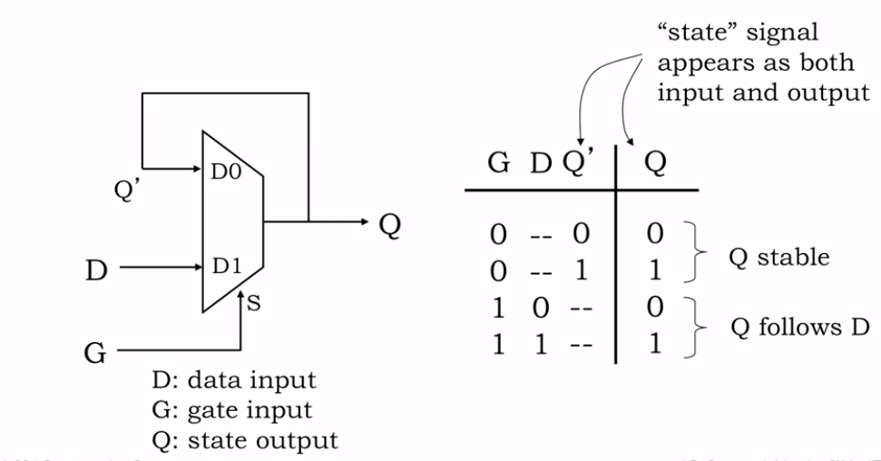
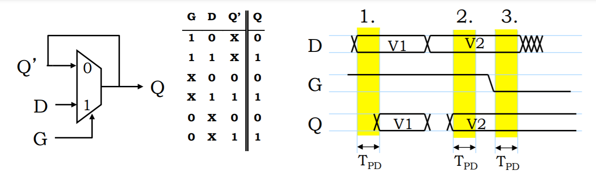
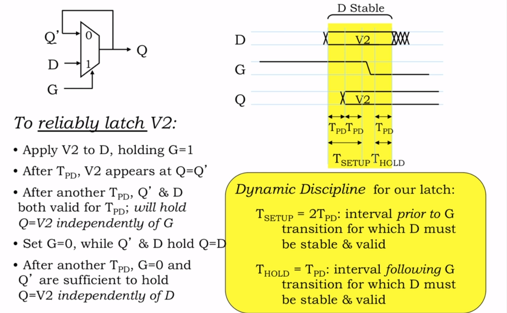

# Sequential Logic（顺序逻辑）

假设有一种新的需求：当灯是开的，按按钮之后使灯关闭；当灯是关的，按下按钮后使灯打开，则无法使用 combinational logic 去解决这种需求，因为 

1. 灯的开关状态并不取决于 input，而是取决于之前的 state。对于相同的 input, 根据 state 的不同会有不同的 output
2. 我们现在面对的需求是『单击按钮』，而不是『按紧按钮』或者『松开按钮』。input 是一种 event，而不是一种 level。

因此我们需要引入 sequential logic 来解决这个问题。

1. Combinational Logic 有两个输入，产生两组输出
   - **当前状态**和**当前输入值**一起作为顺序逻辑的输入
   - 产生出两个输出： **Next State** （Current State 相同位数），**OUTPUT**
2. Memory Device 有两个输入，一个输出
3. LOAD 控制信号解决什么时候用 next state 代替 current state，用什么代替
   - 由 **Next State 和 LOAD 控制信号的输入值**产生 Current State
4. Memory Device 有 bits 为单位的储存空间。如果能储存 K 位，Memory Device 最多有 2^K 个状态
 
## 如何设计出能储存状态的 Memory Device

### 方案1. 使用电容器
bits 是用电压表示的 (0V 表示 0，3V 表示 1)，因此考虑用电容来储存特定电压

电容器一端连接某个稳定的参考电压 Vref，电容器的另一端连接 NFET，NFET 的 Gate 连接 word line

要将一些信息写入设备：
- bit line 连接预定的电压 (digit 0 or digit 1)
- 把 word line 调高使得 NFET 打开
- 电容器充电或放电，总之达到了与 bit line 相同的电压
- 达到以后， word line 调低以关闭 NFET，理想情况下电荷会无期限停留在电容上

要访问储存的信息：
- bit line 达到某个中间电压
- 把 word line 调高使得 NFET 打开
- bit line 变高 -> 电容器储存的是 1
- bit line 变低 -> 电容器储存的是 0
- 但这种变化是很小的，要用到一种非常灵敏的放大器（感应放大器），

优点：
- 电容器价格便宜
缺点
- 交互复杂，access 时间长
- 外部电气噪音会导致电容器的电荷变化
- NFET 有漏电流，即使正式关上也没有关紧，需要反复读取和重写储存值以定期刷新内存

### 改进方案2. bi-stable storage
使用 positive feedback 来永久维护 storage

这是『双稳态存储元件』 (bi-stable storage)，这个逻辑门是为了恢复边缘信号电平而建立的，所以噪声不是问题

- 两端是稳定的，因此不会被噪音影响
- 中间是介稳态，总会滑向两端中的任意一端

## settable storage element (可配置存储元件)
settable storage element 称为 latch。

### 使用 MUX 构建 settable storage element

D latch 的特性：D 接数据输入，G 接 load 信号
- G 为 1，MUX 的输出与 Q' 无关，只与 D 有关
- G 为 0，MUX 的输出与 D 无关，只与 Q' 有关  （储存模式）

### 避免 G 的变化不会影响 Q 的输出
使用宽松的 MUX，TPD 为该 MUX 的传播延迟。

在以下情况下输出值是有效值（D：数据输入，G：load 信号，Q：输出值，Q'：前一个 Q）：
1. G=1，D 在 TPD 的时间内稳定后，则保证 Q 的值与 Q' 无关（load信号是1，则输出与上一个输出无关，只与数据输入有关，这是非存储模式）
2. G=0，D 在 TPD 的时间内稳定后，则保证 Q 的值与 D 无关 （load信号是0，则输出与数据输入无关，只与上一个输出有关，这是存储模式）
3. Q=D 在 TPD 的时间内稳定后，则保证 Q 的值与 G 无关 （我们要确保 G 在变化时不会影响 Q 的输出）

### 可靠的 D latch 设计

load 信号变化时，输出变化的情况

需要含有最少 D stable 的时间：  
G 改变前需要 2 个 TPD 的时间来达到稳定，G 改变后需要 1 个 TPD 的时间

