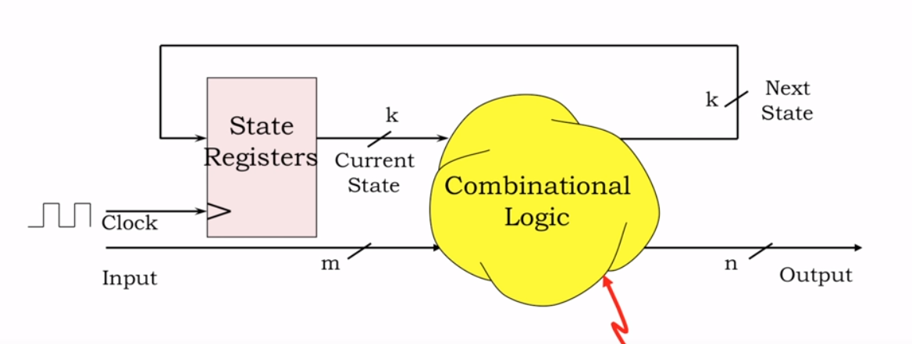
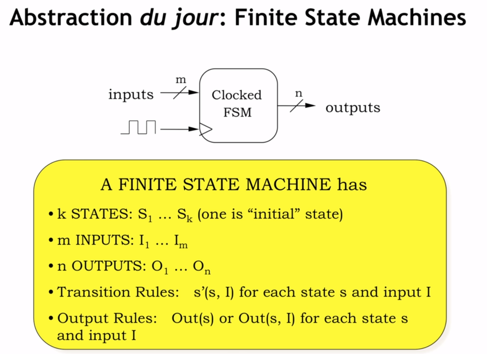

# Finite State Machines（有限状态机）
作者：张托尼
链接：https://zhuanlan.zhihu.com/p/172024745
## 1. Why Finite State Machine？
引进finite state machine（FSM），即有限状态机，可以用来帮助我们更好地设计sequential logic system。

- 有 k+m 个输入和 k+n 个输出,对应的真值表是 2^(k+m)行 * (k+n)列
- State Registers 用来记录当前状态，这个 state 被编码成 k 个 bits，意味着可以表示 2^k 个不同的 state。
  
## 2. Finite State Machine
FSM 应该包含:
- k 个状态 s（一个初始状态）
- m 个输入 I
- n 个输出 O
- 状态规则 (s,I) -> s'
- 输出规则 (s,I) -> O

作为设计者，我们需要：
- 决定不同的 input sequences 所对应的 output sequences
- 确定状态转移的规则
- 确定FSM的初始状态

## 3. State Transition Diagrams
假如现在需要设计一个 combination lock，这个锁只有一个 input 和一个 output，
input 和 output 的值为 0 或者 1。而且当且仅当最近的 4 次输入的序列为 0110 时，
output 为 1，其余时刻 output 为 0。  
那如何去设计呢？我们会理所当然地想到将最近的4个输入序列记住，然后跟0110逐个去比对，但是这样效率太低了。比如说我们按顺序输入0000110，首先它会将序列0000和0110比较，然后将0001和0110比较，然后将0011和0110比较，最后将0110和0110比较。

